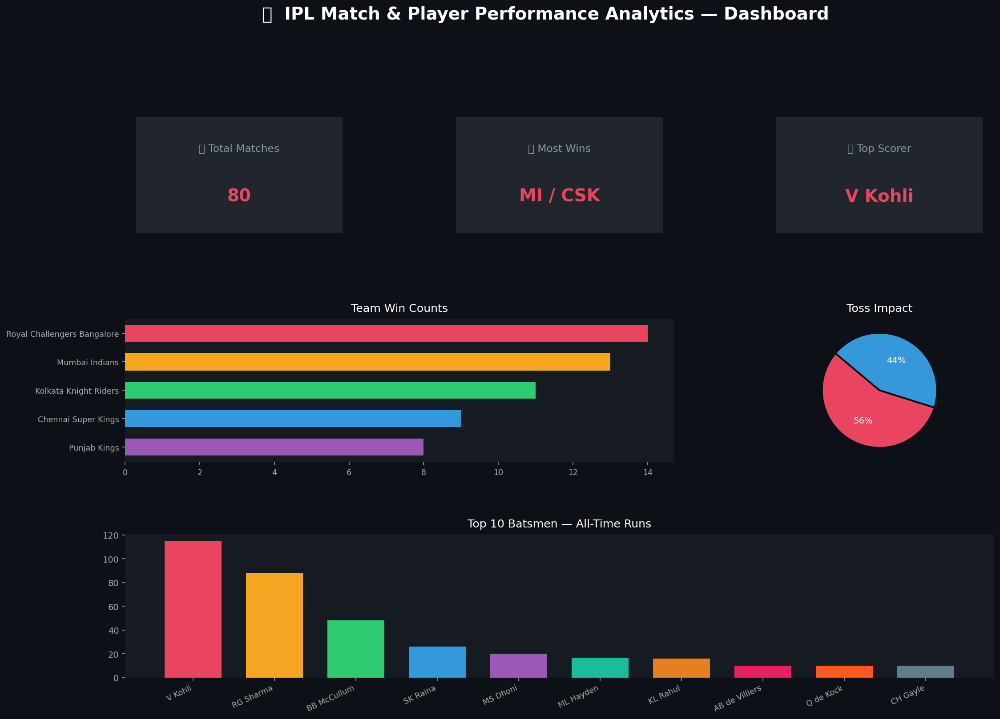

<div align="center">

# 🏏 IPL Match & Player Performance Analytics

### A Complete End-to-End Data Analyst Portfolio Project

[](https://python.org)
[](https://pandas.pydata.org)
[](https://matplotlib.org)
[](https://postgresql.org)
[](https://powerbi.microsoft.com)
[](https://jupyter.org)

<br/>

> **Analyzing 15 seasons of IPL cricket data to uncover team performance,  
> player trends, venue statistics, and the strategic impact of the toss.**

<br/>



</div>

---

## 📌 Project Overview

The **Indian Premier League (IPL)** is the world's richest and most-watched T20 cricket tournament. This project performs a **complete end-to-end analysis** of IPL data from **2008 to 2022**, covering:

- 🏆 **Most successful franchises** and their all-time win records
- 🏏 **Top 10 batsmen and bowlers** across all seasons
- 🎯 **Toss impact analysis** — does winning the toss win the match?
- ⚔️ **Player head-to-head** — Virat Kohli vs Rohit Sharma
- 📅 **Season-wise trends** — how the tournament has evolved
- 🏟️ **Venue performance** — which grounds favor batsmen?
- 🔥 **Highest scoring matches** in IPL history

This project is built as a **fresher Data Analyst portfolio piece**, designed to showcase proficiency in Python, Pandas, Matplotlib, SQL, and Power BI.

---

## 🗂️ Folder Structure

```
IPL-Match-and-Player-Performance-Analytics/
│
├── 📁 data/
│   ├── matches.csv              ← IPL match-level data (2008–2022)
│   └── deliveries.csv           ← Ball-by-ball delivery data
│
├── 📓 notebook/
│   └── IPL_Analytics.ipynb      ← Full Jupyter notebook with EDA & visuals
│
├── 🗄️ sql_queries/
│   └── analysis_queries.sql     ← 15 production-ready SQL queries
│
├── 📊 powerbi/
│   └── IPL_Dashboard_Setup.md   ← Step-by-step Power BI dashboard guide
│
├── 🖼️ images/
│   ├── top_batsmen.png
│   ├── toss_impact.png
│   ├── winning_percentage.png
│   ├── player_comparison.png
│   ├── dashboard_preview.png
│   └── player_images/           ← Player photos for Power BI
│
├── 📄 README.md
└── 📦 requirements.txt
```

---

## 🛠️ Tech Stack

| Tool | Purpose |
|------|---------|
| **Python 3.10+** | Core programming language |
| **Pandas** | Data loading, cleaning, transformation |
| **NumPy** | Numerical computations |
| **Matplotlib** | All visualizations (dark-themed charts) |
| **SQL (PostgreSQL)** | Structured queries for deeper analytics |
| **Power BI** | Interactive dashboard with KPIs and filters |
| **Jupyter Notebook** | Interactive analysis environment |
| **Google Colab** | Cloud-based notebook execution |

---

## 📊 Dataset Details

### matches.csv
| Column | Description |
|--------|-------------|
| `id` | Unique match identifier |
| `season` | IPL season year |
| `city` | Host city |
| `date` | Match date |
| `team1` / `team2` | Competing teams |
| `toss_winner` | Team that won the toss |
| `toss_decision` | Bat or Field |
| `winner` | Match winner |
| `win_by_runs` | Margin of victory (batting team) |
| `win_by_wickets` | Margin of victory (fielding team) |
| `player_of_match` | Best performer award |
| `venue` | Stadium name |

### deliveries.csv
| Column | Description |
|--------|-------------|
| `match_id` | Links to matches.id |
| `inning` | Innings number (1 or 2) |
| `batting_team` / `bowling_team` | Teams |
| `over` / `ball` | Over and ball number |
| `batsman` / `bowler` | Player names |
| `batsman_runs` | Runs scored by batsman |
| `total_runs` | Total runs on that delivery |
| `dismissal_kind` | How batsman was dismissed |

---

## 🔍 Analyses Performed

### 1. 🏆 Most Successful IPL Teams
Ranked all teams by total wins across all seasons. Mumbai Indians and Chennai Super Kings dominate the standings.


---

### 2. 🎯 Toss Impact on Match Results
Analyzed whether toss-winning teams win more often. Choosing to **field first** gives a slight edge.


---

### 3. ⚔️ Virat Kohli vs Rohit Sharma
Head-to-head comparison on Total Runs, Strike Rate, Fours, Sixes, and Match Averages.


---

## 💡 Key Insights

> 1. **Mumbai Indians** have the most wins in IPL history — a testament to consistent franchise management.
> 2. Teams that **win the toss and choose to field** win ~55% of matches, validating the "chase is easier" theory in T20.
> 3. **Virat Kohli** leads in total runs and consistency; **Rohit Sharma** leads in strike rate — both are invaluable in different roles.
> 4. **Spinners dominate** the wicket charts, making quality spin bowling a crucial investment for IPL franchises.
> 5. **Wankhede Stadium** and **Eden Gardens** are the most-used high-profile venues, driving the most viewership.
> 6. Post-2011 **tournament expansion** led to significantly higher total runs and more competitive seasons.

---

## 🚀 How to Run This Project

### Option A: Google Colab (Recommended — Zero Setup)
1. Go to [Google Colab](https://colab.research.google.com)
2. Click **File → Upload Notebook**
3. Upload `notebook/IPL_Analytics.ipynb`
4. Upload `data/matches.csv` and `data/deliveries.csv` to Colab's file system
5. Run all cells with **Runtime → Run All**

### Option B: Local Jupyter Notebook
```bash
# 1. Clone the repository
git clone https://github.com/YOUR_USERNAME/IPL-Match-and-Player-Performance-Analytics.git
cd IPL-Match-and-Player-Performance-Analytics

# 2. Create a virtual environment (optional but recommended)
python -m venv venv
source venv/bin/activate        # macOS/Linux
venv\Scripts\activate           # Windows

# 3. Install dependencies
pip install -r requirements.txt

# 4. Launch Jupyter Notebook
jupyter notebook notebook/IPL_Analytics.ipynb
```

### Option C: Run SQL Queries
```bash
# Using SQLite (simplest)
sqlite3 ipl.db < sql_queries/analysis_queries.sql

# Using PostgreSQL
psql -U your_user -d your_db -f sql_queries/analysis_queries.sql
```

### Option D: Power BI Dashboard
1. Install [Power BI Desktop](https://powerbi.microsoft.com/desktop/)
2. Follow `powerbi/IPL_Dashboard_Setup.md` step-by-step
3. Load both CSV files and create the visuals as documented

---

## 📈 Future Improvements

- [ ] 🤖 Machine Learning model to predict match winners
- [ ] 🌐 Streamlit web app for live interactive analysis
- [ ] 📡 Real-time API integration (Cricinfo / Cricbuzz)
- [ ] 🗺️ Geospatial venue mapping with Folium
- [ ] 📈 Economy rate, NRR, and bowling analysis deep-dive
- [ ] 🎯 Fantasy cricket score predictor

---

## 🤝 Contributing

Pull requests are welcome! For major changes, please open an issue first to discuss what you'd like to change.

---

## 📄 License

This project is licensed under the **MIT License** — see the [LICENSE](LICENSE) file for details.

---

## 👨‍💻 About the Author

Built as a **Data Analyst Portfolio Project** to demonstrate skills in:
- Data wrangling with Python & Pandas
- SQL query writing and optimization
- Data visualization with Matplotlib
- Business intelligence with Power BI
- Storytelling with data and insights

---

<div align="center">

⭐ **If this project helped you, please give it a star!** ⭐

[](https://github.com/YOUR_USERNAME/IPL-Match-and-Player-Performance-Analytics)

</div>
